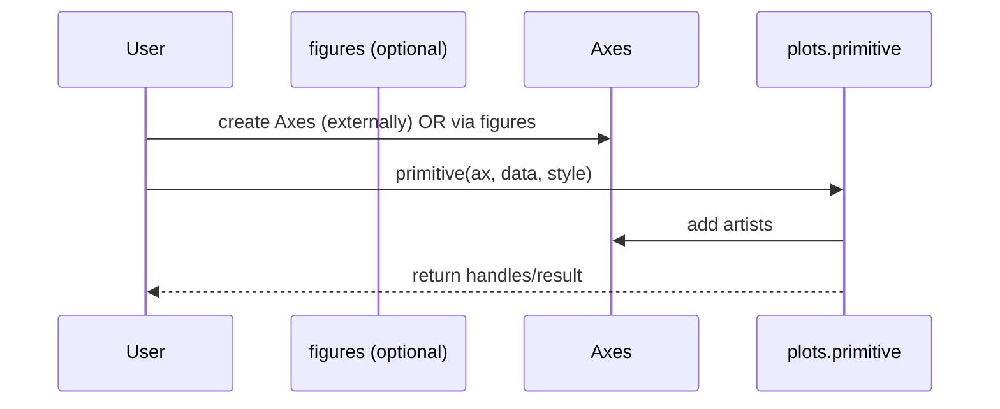
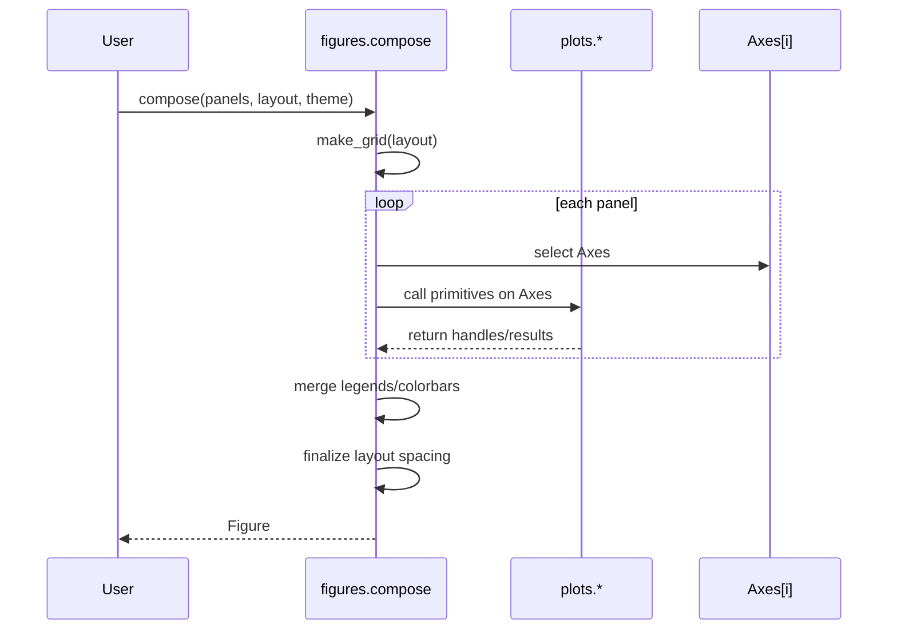

# Figures Architecture Design

## Introduction

This document describes the technical design for a visualization library architecture that separates axis-level plot primitives (`plots/`) from figure-level orchestration (`figures/`). The goal is to make rendering composable, testing straightforward, and multi-panel layout + styling consistent.

## 1. Architecture Overview

### Layered Modules

- **plots/** (rendering primitives)
  - Pure-ish functions that draw onto a provided target (e.g., Matplotlib `Axes`).
  - No figure creation, no layout, no global style mutation.
- **figures/** (orchestration)
  - Creates/manages `Figure` and axes grids.
  - Applies themes/templates and resolved styling.
  - Composes primitives across panels and manages shared guides and scales.
- **palettes/**
  - Defines palette specifications and utilities for categorical/sequential color choices.
- **utils/**
  - Shared utilities: data validation and reshaping, color conversion, type helpers.

### Dependency Graph

- `figures` → may depend on `plots`, `palettes`, `utils`
- `plots` → may depend on `palettes`, `utils` (but not `figures`)
- `palettes` → may depend on `utils`
- `utils` → depends on standard library and minimal third-party dependencies

## 2. Responsibilities and Non-Responsibilities

### plots/ Responsibilities

- Accept an explicit target object (e.g., `ax`).
- Draw artists/traces onto that target.
- Return structured results that support composition:
  - artist handles for legends
  - mappables + normalization metadata for colorbars
  - computed limits if needed (optional)

### plots/ Non-Responsibilities

- Figure creation (`plt.figure`, `plt.subplots`, etc.).
- Subplot layout decisions (`GridSpec`, constrained layout, tight layout).
- Theme/template selection.
- Exporting, saving, or showing figures.
- Global styling mutation (e.g., `rcParams`).

### figures/ Responsibilities

- Create figure and axes grids.
- Apply a theme/template policy.
- Resolve style tokens into concrete keyword args for primitives.
- Compose multiple primitives into a cohesive figure.
- Manage shared guides:
  - legend merging and placement
  - shared colorbars and color axis policies
- Manage shared scale policies:
  - shared x/y limits across facets
  - shared color normalization across heatmaps
- Own export/show policies (DPI, sizing, background, file writing).

## 3. Public API Design (Conceptual)

This design intentionally keeps plot primitives simple and pushes orchestration into figure-level helpers.

### plots API

Each primitive follows a consistent signature pattern:

```python
def scatter( ax, *, x, y, c=None, label=None, style=None, **kwargs):
    """Draw scatter points on `ax` and return handles for composition."""
    ...
```

Return values:

- For single-handle primitives: return the handle directly.
- For multi-handle primitives: return a structured result object.

Example structured result:

```python
from dataclasses import dataclass
from typing import Any, Optional

@dataclass(frozen=True)
class ScatterResult:
    collection: Any
    mappable: Optional[Any] = None
```

### figures API

Recommended figure-level entry points:

- `figures.make_grid(...)` for reusable layout creation.
- `figures.compose(...)` to assemble panels and manage shared guides.
- `figures.apply_theme(...)` and `figures.templates.*` for theming policies.

Conceptual interface:

```python
def make_grid(*, nrows, ncols, size=None, sharex=False, sharey=False, template=None):
    return fig, axes

def compose(*, panels, layout, theme=None, legend="shared", colorbar="shared"):
    """Create a figure, call panel functions with axes, then finalize guides/layout."""
    return fig
```

`panels` should be a sequence of callables that accept an Axes and call plot primitives.

## 4. Style System Design

### Style Tokens vs Resolved Style

- **Style tokens** (theme/template level): semantic names like `"primary"`, `"grid"`, `"font_scale"`.
- **Resolved style** (primitive level): concrete kwargs like `color="#4C78A8"`, `lw=2`, `alpha=0.8`.

Design rule:

- `figures/` is responsible for converting style tokens to resolved style kwargs.
- `plots/` is responsible only for applying resolved style kwargs to artists.

### Recommended Modules

- `figures/styles.py`: theme definitions and token-to-kwargs resolution.
- `figures/templates.py`: templates that bundle theme + layout + export defaults.
- `palettes/*`: reusable palette definitions used by style resolution.

## 5. Layout and Composition Design

### Grid Layout

The layout engine lives in `figures/` and is the single authority for:

- subplot sizing and spacing
- shared axes policies
- placement of figure-level annotations (suptitle, panel labels)

### Guide Management

Guides are created and placed by `figures/` based on the structured results returned by primitives.

Legend policy examples:

- `legend="none"`: no legend
- `legend="per-axes"`: legend per subplot
- `legend="shared"`: one combined legend for the full figure

Colorbar policy examples:

- `colorbar="none"`
- `colorbar="per-axes"`
- `colorbar="shared"` (with shared normalization)

### Scale Resolution

For composite figures, `figures/` owns scale resolution policies:

- Shared x/y limits across panels when requested.
- Shared color normalization when requested (for heatmaps).

## 6. Sequence Diagrams

### Single Panel Primitive



### Multi-Panel Composition



## 7. Error Handling and Validation

### plots/

- Validate required inputs (e.g., `x` and `y` shapes compatible).
- Raise clear exceptions with actionable messages.
- Avoid partial state changes when validation fails (fail early).

### figures/

- Validate layout arguments (`nrows*ncols` matches panels).
- Validate guide/scale policy combinations (e.g., shared colorbar requires compatible mappables).
- Provide deterministic resolution when conflicts occur (documented precedence rules).

## 8. Testing Strategy

### Unit Tests (plots)

- Create a headless Axes and call each primitive.
- Assert artists were added and returned handles are non-null.
- Assert global style state is unchanged.
- Assert no figure creation is performed (e.g., no `plt.figure()` usage).

### Integration Tests (figures)

- Compose a small grid with multiple panels.
- Assert axis count and layout dimensions.
- Assert shared legend/colorbar policies produce the intended number of guides.
- Optionally validate saved output metadata (size/DPI) without strict image comparison.

## 9. Implementation Notes

## Minimal Data Model

- Use small immutable result objects (dataclasses with `frozen=True`) for plot results.
- Keep style resolution separate from drawing.

## 10. Trade-offs

- This separation may introduce slightly more code (extra composition and result objects), but reduces duplication and enables consistent multi-panel output.
- Some convenience wrappers might feel redundant at first; treat them as figure-level recipes rather than expanding primitive responsibilities.

## 11. Open Questions

- Should primitives accept a backend-agnostic target protocol, or explicitly Matplotlib `Axes` first?
- Should style tokens be a simple dict, or a typed object for better discoverability?
- Should the library support optional image regression testing, or rely on structural assertions only?
