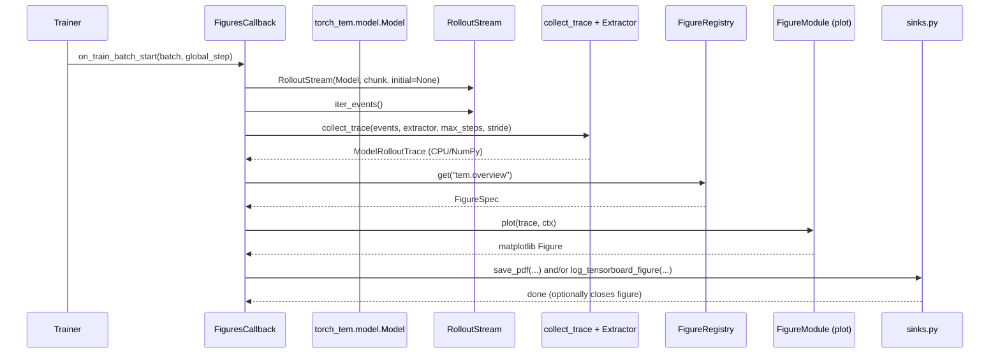
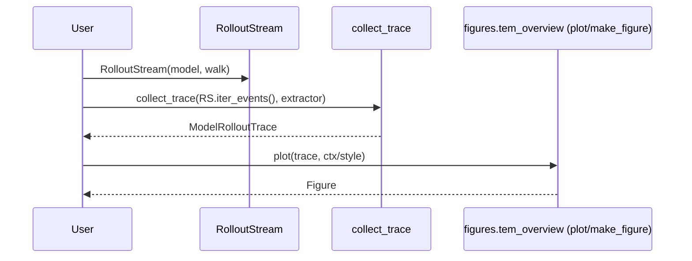

# Figures Subsystem — Design

## Status

Planned (design-first)

## High-Level Architecture

### Layers and Responsibilities

1. Streams (live, online)
   - torch_tem.model.RolloutStream: iterates a walk through the model, yielding (TEMOutput, TEMLabel, TEMState).
   - Extended with Option 1: RolloutStream.iter_events() to yield richer RolloutEvent objects (includes actions / a_prev).

2. Diagnostics / Adapters (offline, CPU/NumPy)
   - Generic collect_trace(...) utility consumes a stream of events and a TraceExtractor.
   - Concrete extractors produce plot-ready traces:
     - ModelRolloutTrace (TEM outputs over time; CPU NumPy arrays).
     - DataRolloutTrace (environment + walk statistics; CPU structures).
   - Invariant: traces contain CPU/NumPy only.

3. Figures (pure plotting)
   - Figure modules accept traces + styling/context and return matplotlib.figure.Figure.
   - No filesystem/Lightning dependencies.

4. Orchestration (outside figures)
   - torch_tem.callbacks.FiguresCallback: decides when to extract trace(s), which figures to generate, and which sinks to use.
   - torch_tem.figures.sinks: persists figures (PDF/PNG, TensorBoard previews).

### Package Layout (target)

- src/torch_tem/figures/
  - primitives.py (existing)
  - style.py (existing)
  - sinks.py (existing)
  - tem_overview.py (existing; will be registry-registered)
  - core/
    - types.py (Protocols: PlotTrace, TraceExtractor, registry spec types)
    - collect.py (generic collect_trace)
    - registry.py (figure registry)
    - context.py (FigureContext metadata; style; default figsize; etc.)
  - Future (planned, not required in first slice):
    - environment/layout.py
    - walk/trajectories.py, walk/statistics.py
    - split/statistics.py

## Key Interfaces

### 1) Rollout Events (Option 1)

Define RolloutEvent dataclass in a diagnostics-friendly module.

Fields:

- t: int
- locations: list[LocationLabel]
- observation: Observation
- action: list[Optional[int]] (current step action list)
- a_prev: list[Optional[int]] (previous actions used for reset logic)
- output: TEMOutput
- label: TEMLabel
- state: TEMState

Add to RolloutStream:

- iter_events(self) -> Iterator[RolloutEvent]
- Does not change **next** output; existing code remains valid.

### 2) PlotTrace Protocol

Define PlotTrace as a Protocol (capabilities-based, not field-based):

- batch_size: int
- n_steps: int
- select_env(env_idx: int) -> Self
- downsample_time(stride: int) -> Self
- meta: Mapping[str, Any] (recommended for run/split/step metadata)

Concrete traces implement this Protocol.

### 3) TraceExtractor Protocol

Generic builder:

- observe(event: EventT) -> None
- finalize() -> TraceT

TraceT must satisfy PlotTrace when used for figures.

### 4) collect_trace

collect_trace(stream, extractor, \*, max_steps: Optional[int], downsample_stride: int) -> TraceT

Semantics:

- Iterate stream events.
- Keep event if step_count % downsample_stride == 0.
- Stop when step_count >= max_steps (counts observed events).
- Raise ValueError if no samples were collected (unless extractor declares empty_ok).

### 5) Figure Registry

Registry is the single source of truth for name → plotting function mapping.

FigureSpec fields:

- name: str (stable id, e.g., "tem.overview")
- description: str
- plot(trace: PlotTrace, ctx: FigureContext) -> matplotlib.figure.Figure
- accepts: type[PlotTrace] (start type-based; predicate optional later)
- optional: default_filename: str, tags: set[str]

FigureRegistry:

- register(spec: FigureSpec) -> None
- get(name: str) -> FigureSpec
- list() -> list[FigureSpec]
- validate(names: list[str]) -> None (used by Settings validation and callback startup)

Registry import model (explicit import, recommended):

- A single module imports known figure modules (e.g., tem_overview) and registers them deterministically.

## Data Flow / Sequence Diagrams

### A) Lightning callback figure generation

### B) Notebook usage (pure figures)

## Migration Plan (Design)

1. Keep existing TEMRolloutTrace initially but rebrand as ModelRolloutTrace (type alias or new name).
2. Rewrite extract_rollout_trace into:
   - a concrete extractor (ModelRolloutTraceExtractor)
   - and a thin wrapper function for compatibility.
3. Introduce registry and register tem_overview as "tem.overview".
4. Update callback dispatch to registry lookup.

## Alternatives Considered

- Dynamic import by name (rejected): couples config strings to module paths; weaker validation; harder to list figures.
- One mega GenericPlotTrace dataclass (rejected): becomes a dumping ground; harms maintainability; Protocol + concrete traces is better.
- Extending RolloutStream to store full trace (rejected): breaks streaming/memory efficiency; extraction should remain offline.

## Dependencies

- Matplotlib + NumPy (already used).
- Existing Lightning callback + TensorBoard logging utilities (already present).
- typing.Protocol + TypeVar.

## Testing Strategy

- Unit tests for:
  - collect_trace stride/max_steps semantics.
  - RolloutStream.iter_events() correctness (actions and a_prev alignment).
  - Registry: register/get/list/validate.
- Smoke test:
  - Generate "tem.overview" from a short trace and ensure a Figure is returned and closed appropriately by sinks.
